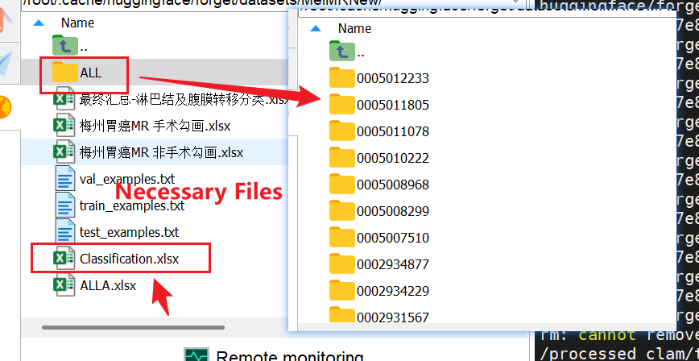
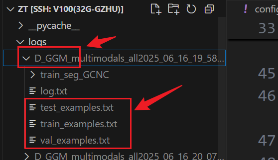
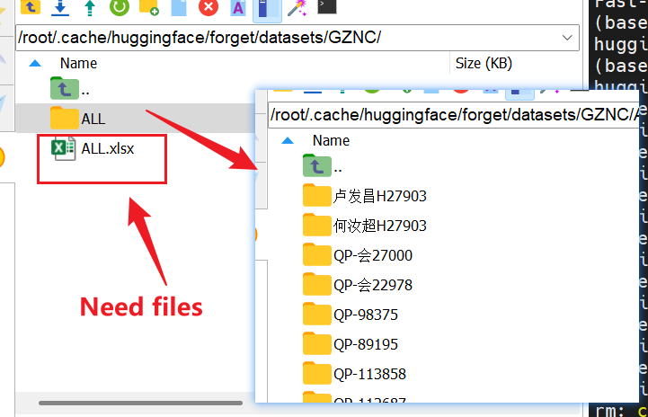

# 广肿 MR 数据实验

## how to set the dataset
### GCM: 胃部癌症 MRI 数据集。

### 1.base dataset setup:



when you set this dataset, you need to rewrite the `GCM_loader.root` in `config.yml` as your right dataset's path.

### 2. how to fix examples:

when you run train_classify_GCM.py, you will note that there will generate a log dir in your project like that:



In this time, you can copy `train_examples.txt`, `val_examples.txt` and `test_examples.txt` to `GCM_loader.root` like fig 1.

when you finish this work, and set `GCM_loader.fix_example` as `True`, the training process will use fixed examples.

### GCNC: 鼻咽癌症 MRI 数据集。
### base dataset setup:


This dataset setting style is same as `GCM`, all files are in this fig.


## get project
```
git clone https://github.com/JeMing-creater/GZ_Tumor.git
```

## requirements
```
pip install -r requirements.txt
```

## training
single device training for GCM classification.
```
python3 train_classify_GCM.py
```
multi-devices training, user need to rewrite running target in this .sh flie.
```
sh run.sh
```

# tensorboard
```
tensorboard --logdir=/logs
```
